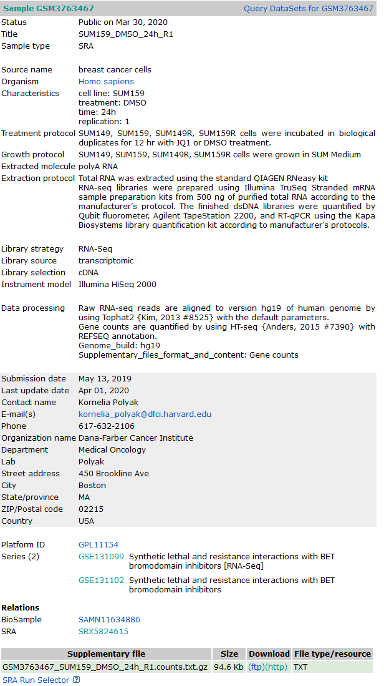
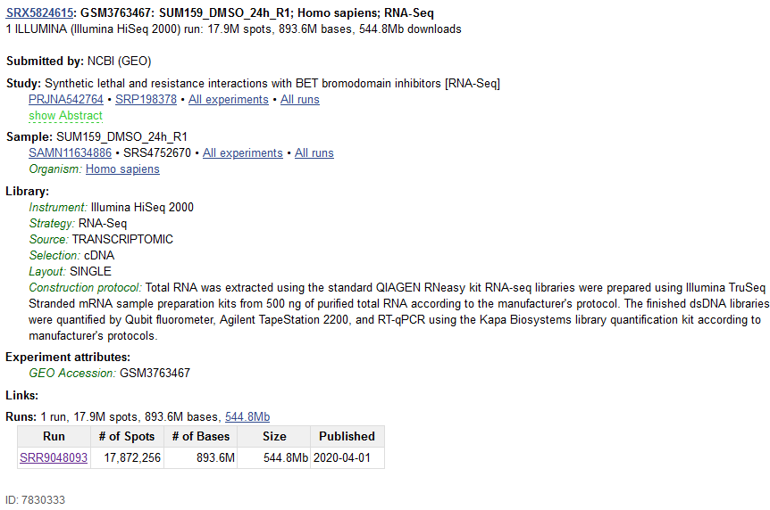
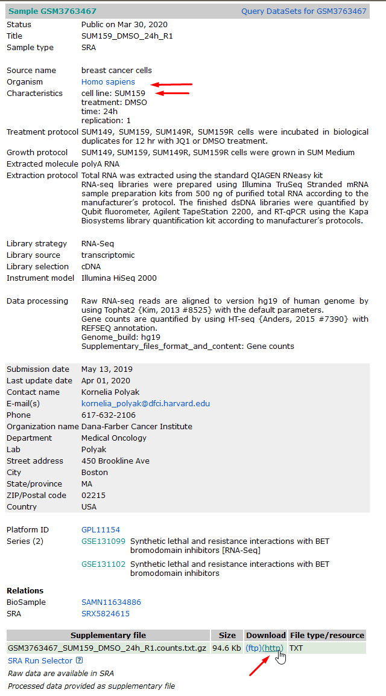

This notebook will download all data. We assume the working directory is the root cibog dir!

```{python}
import os
from IPython.display import Image


if os.getcwd().endswith("code"):
    os.chdir("..")
```

```{python}
! pwd
```

# Install sratoolkit to download SRA-hosted sequencing data

For this we first need to install sratoolkit for downloading SRA-hosted files.

```{python}
! wget --output-document tools/sratoolkit.tar.gz http://ftp-trace.ncbi.nlm.nih.gov/sra/sdk/current/sratoolkit.current-ubuntu64.tar.gz

! cd tools && tar -vxzf sratoolkit.tar.gz
```

Briefly run vdb-config and exit without changes

```{python}
! vdb-config --interactive
```

# Downloading and preparing data

## Bulk Data

## Downloading and processing bulk data from reads

In order to be able to process the bulk data from reads we need several softwares and references.

Make sure to install hisat2 and samtools (e.g. sudo apt-get install hisat2/samtools in Ubuntu).

We also need featureCounts which is part of the subreads package: https://sourceforge.net/projects/subread/files/subread-2.0.3/ . Also make sure install a copy of that :)

```{python}
! cd tools && wget -O subread-2.0.3-source.tar.gz https://jztkft.dl.sourceforge.net/project/subread/subread-2.0.3/subread-2.0.3-source.tar.gz
```

Extract the subread-archive in the tools folder:

```{python}
! cd tools && tar xfz subread-2.0.3-source.tar.gz
```

And build the subread package:

```{python}
! cd tools/subread-2.0.3-source/src && make -f Makefile.Linux -j 4
```

We can now check that featureCounts was built and is executable:

```{python}
! tools/subread-2.0.3-source/bin/featureCounts -v
```

Now that everything is installed, let's download and rename the files! At the end we will download all required references (genome for alignment + genome annotation for counting):

We first navigate from the GEO Series https://www.ncbi.nlm.nih.gov/geo/query/acc.cgi?acc=GSE131102 to a single sample (GSM) we want to download. There we follow the relation to SRA (at the bottom):



On the SRX record page (SRA Experiment) you can find the SRR (SRA Run) IDs of all relevant files. Here, we expect unpaired reads and just one file per sample. You can now download the SRR-run data with fastq-dump from the command line:



```{python}
#24h R1
! cd reads/bulk/ && fastq-dump --gzip SRR9048093
#24h R1
! cd reads/bulk/ && fastq-dump --gzip SRR9048094
#JQ1 24h R1
! cd reads/bulk/ && fastq-dump --gzip SRR9048103
#JQ1 24h R1
! cd reads/bulk/ && fastq-dump --gzip SRR9048104
```

For easier refrence we rename the SRR files to more interpretable names:

```{python}
! mv reads/bulk/SRR9048093.fastq.gz reads/bulk/SUM159_24h_R1.fastq.gz
! mv reads/bulk/SRR9048094.fastq.gz reads/bulk/SUM159_24h_R2.fastq.gz
! mv reads/bulk/SRR9048103.fastq.gz reads/bulk/SUM159R_24h_R1.fastq.gz
! mv reads/bulk/SRR9048104.fastq.gz reads/bulk/SUM159R_24h_R2.fastq.gz
```

Hisat2 is going to be used for aligning the reads to the reference genome. You should have already installed Hisat2 (else: sudo apt-get install hisat2). We chose to download the GRCh38 reference genome. Instructions on how to run Hisat2, or for other reference genomes, visit: http://daehwankimlab.github.io/hisat2/ 

```{python}
! cd references && wget -O hsapiens_hisat2.tar.gz https://genome-idx.s3.amazonaws.com/hisat/grch38_genome.tar.gz
```

We also extract this tar.gz file:

```{python}
! cd references && tar xfz hsapien_hisat2.tar.gz
```

And download the genome reference from ensembl. You should ensure that this matches the reference genome in terms of chromosome identifiers (chr1 vs 1):

```{python}
! cd references && wget -O ensembl.105.annotation.gtf.gz http://ftp.ensembl.org/pub/release-105/gtf/homo_sapiens/Homo_sapiens.GRCh38.105.gtf.gz
```

```{python}
! cd references && gunzip ensembl.105.annotation.gtf.gz
```

## Download preprocessed gene expression files from GEO

Instead of downloading the reads and doing the alignment+counting by oneself, one can also rely on the processed outputs of the original authors. These are available from each GEO sample (GSM record):

First the 24h samples:



```{python}
! cd bulk && wget -O GSM3763467_SUM159_DMSO_24h_R1.counts.txt.gz "https://www.ncbi.nlm.nih.gov/geo/download/?acc=GSM3763467&format=file&file=GSM3763467%5FSUM159%5FDMSO%5F24h%5FR1%2Ecounts%2Etxt%2Egz"
! cd bulk && wget -O GSM3763468_SUM159_DMSO_24h_R2.counts.txt.gz "https://www.ncbi.nlm.nih.gov/geo/download/?acc=GSM3763468&format=file&file=GSM3763468%5FSUM159%5FDMSO%5F24h%5FR2%2Ecounts%2Etxt%2Egz"

! cd bulk && wget -O GSM3763477_SUM159_JQ1R_DMSO_24h_R1.counts.txt.gz "https://www.ncbi.nlm.nih.gov/geo/download/?acc=GSM3763477&format=file&file=GSM3763477%5FSUM159%5FJQ1R%5FDMSO%5F24h%5FR1%2Ecounts%2Etxt%2Egz"
! cd bulk && wget -O GSM3763478_SUM159_JQ1R_DMSO_24h_R2.counts.txt.gz "https://www.ncbi.nlm.nih.gov/geo/download/?acc=GSM3763478&format=file&file=GSM3763478%5FSUM159%5FJQ1R%5FDMSO%5F24h%5FR2%2Ecounts%2Etxt%2Egz"
```

Then the 3h samples:

```{python}
! cd bulk && wget -O GSM3763469_SUM159_DMSO_3h_R1.counts.txt.gz "https://www.ncbi.nlm.nih.gov/geo/download/?acc=GSM3763469&format=file&file=GSM3763469%5FSUM159%5FDMSO%5F3h%5FR1%2Ecounts%2Etxt%2Egz"
! cd bulk && wget -O GSM3763470_SUM159_DMSO_3h_R2.counts.txt.gz "https://www.ncbi.nlm.nih.gov/geo/download/?acc=GSM3763470&format=file&file=GSM3763470%5FSUM159%5FDMSO%5F3h%5FR2%2Ecounts%2Etxt%2Egz"

! cd bulk && wget -O GSM3763479_SUM159_JQ1R_DMSO_3h_R1.counts.txt.gz "https://www.ncbi.nlm.nih.gov/geo/download/?acc=GSM3763479&format=file&file=GSM3763479%5FSUM159%5FJQ1R%5FDMSO%5F3h%5FR1%2Ecounts%2Etxt%2Egz"
! cd bulk && wget -O GSM3763480_SUM159_JQ1R_DMSO_3h_R2.counts.txt.gz "https://www.ncbi.nlm.nih.gov/geo/download/?acc=GSM3763480&format=file&file=GSM3763480%5FSUM159%5FJQ1R%5FDMSO%5F3h%5FR2%2Ecounts%2Etxt%2Egz"
```

```{python}
! ls bulk
```

## Download scRNA-seq data

How to download scRNA-seq data is explained in the next notebook!

