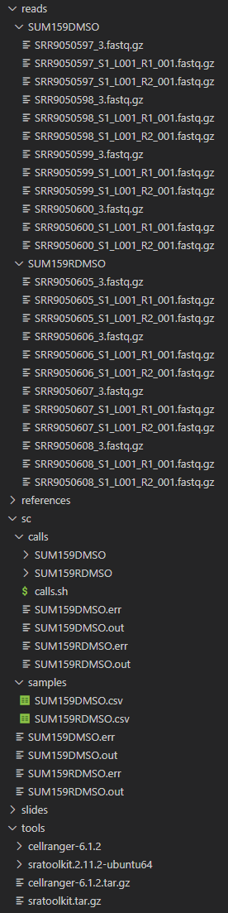

```{python}
import os
from IPython.display import Image


if os.getcwd().endswith("code"):
    os.chdir("..")

```

```{python}
! pwd
```

# Downloading cellranger

Cellranger is available from 10X Genomics and only suitable for their kits/libraries.

Visit the cellranger website (https://support.10xgenomics.com/single-cell-gene-expression/software/downloads/latest, might require registration) and download cellranger (linux) and loupe browsers (choose your OS, e.g. Windows):

```{python}
! cd tools && wget -O cellranger-6.1.2.tar.gz "https://cf.10xgenomics.com/releases/cell-exp/cellranger-6.1.2.tar.gz?Expires=1641958065&Policy=eyJTdGF0ZW1lbnQiOlt7IlJlc291cmNlIjoiaHR0cHM6Ly9jZi4xMHhnZW5vbWljcy5jb20vcmVsZWFzZXMvY2VsbC1leHAvY2VsbHJhbmdlci02LjEuMi50YXIuZ3oiLCJDb25kaXRpb24iOnsiRGF0ZUxlc3NUaGFuIjp7IkFXUzpFcG9jaFRpbWUiOjE2NDE5NTgwNjV9fX1dfQ__&Signature=g2re3W~2ybB0B3sFtdXmM~W2fWTUF4AMKF~46oEqQ0lV9W4IBfJ-7kpnSgAHj7KbIsB-Pu7l2l3gX8i8evLnnmru3x8i6sp72K5eRYgpY7JxypcTuWi9sbF1p8ezHoL5C9dsR0QI3Gx9ZDbu2VA5wrGV7wRi0ehnbXTsUAjOnG87lKAq7khwC~HvcOux9Og8B0WzbSb2Hb1klEoAj5n5Xd~-ta8EoqjeqVdgue0-DVXD36kvU5OkYWOTehNZtTkXxBdDwgbjbKw-8XgZYnie1p8lfDWTZRU16o81-lovv0yq3XFkvh89Kuj84GjwxU6s-~d9Xq-BE8g28DG8vLlGxg__&Key-Pair-Id=APKAI7S6A5RYOXBWRPDA"
```

also download the human reference file (which will also be extracted right away):

```{python}
! cd references && wget https://cf.10xgenomics.com/supp/cell-exp/refdata-gex-GRCh38-2020-A.tar.gz && tar xfz refdata-gex-GRCh38-2020-A.tar.gz
```

Extract the software

```{python}
! cd tools && tar xfz cellranger-6.1.2.tar.gz
```

Now you should briefly verify whether the software was correctly installed and works as intended:

```{python}
! ./tools/cellranger-6.1.2/bin/cellranger sitecheck
```

# Downloading the data

```{python}
! mkdir reads
! mkdir reads/SUM159DMSO
! mkdir reads/SUM159RDMSO
```

```{python}
! cd reads/SUM159DMSO/ && fastq-dump --split-files --gzip SRR9050597
! cd reads/SUM159DMSO/ && fastq-dump --split-files --gzip SRR9050598
! cd reads/SUM159DMSO/ && fastq-dump --split-files --gzip SRR9050599
! cd reads/SUM159DMSO/ && fastq-dump --split-files --gzip SRR9050600
```

```{python}
! cd reads/SUM159RDMSO/ && fastq-dump --split-files --gzip SRR9050605
! cd reads/SUM159RDMSO/ && fastq-dump --split-files --gzip SRR9050606
! cd reads/SUM159RDMSO/ && fastq-dump --split-files --gzip SRR9050607
! cd reads/SUM159RDMSO/ && fastq-dump --split-files --gzip SRR9050608
```

Unfortunately the SRA-format is incompatible with cellranger. You need to manually process it according to https://kb.10xgenomics.com/hc/en-us/articles/115003802691-How-do-I-prepare-Sequence-Read-Archive-SRA-data-from-NCBI-for-Cell-Ranger- .

Based on the read length and the attributes listed in the meta data, we know that:

    SRR9291388_1.fastq is Read 1
    SRR9291388_2.fastq is Read 2
    SRR9291388_3.fastq is Index 1

Cell Ranger requires FASTQ file names to follow the bcl2fastq file naming convention.

[Sample Name]_S1_L00[Lane Number]_[Read Type]_001.fastq.gz

Where Read Type is one of:

    I1: Sample index read (optional)
    I2: Sample index read (optional)
    R1: Read 1 (required)
    R2: Read 2 (required)

```{python}
! mv sc/SUM159DMSO/SRR9050597_1.fastq.gz sc/SUM159DMSO/SRR9050597_S1_L001_R1_001.fastq.gz
! mv sc/SUM159DMSO/SRR9050597_2.fastq.gz sc/SUM159DMSO/SRR9050597_S1_L001_R2_001.fastq.gz

! mv sc/SUM159DMSO/SRR9050598_1.fastq.gz sc/SUM159DMSO/SRR9050598_S1_L001_R1_001.fastq.gz
! mv sc/SUM159DMSO/SRR9050598_2.fastq.gz sc/SUM159DMSO/SRR9050598_S1_L001_R2_001.fastq.gz

! mv sc/SUM159DMSO/SRR9050599_1.fastq.gz sc/SUM159DMSO/SRR9050599_S1_L001_R1_001.fastq.gz
! mv sc/SUM159DMSO/SRR9050599_2.fastq.gz sc/SUM159DMSO/SRR9050599_S1_L001_R2_001.fastq.gz

! mv sc/SUM159DMSO/SRR9050600_1.fastq.gz sc/SUM159DMSO/SRR9050600_S1_L001_R1_001.fastq.gz
! mv sc/SUM159DMSO/SRR9050600_2.fastq.gz sc/SUM159DMSO/SRR9050600_S1_L001_R2_001.fastq.gz
```

```{python}
! mv sc/SUM159RDMSO/SRR9050605_1.fastq.gz sc/SUM159RDMSO/SRR9050605_S1_L001_R1_001.fastq.gz
! mv sc/SUM159RDMSO/SRR9050605_2.fastq.gz sc/SUM159RDMSO/SRR9050605_S1_L001_R2_001.fastq.gz

! mv sc/SUM159RDMSO/SRR9050606_1.fastq.gz sc/SUM159RDMSO/SRR9050606_S1_L001_R1_001.fastq.gz
! mv sc/SUM159RDMSO/SRR9050606_2.fastq.gz sc/SUM159RDMSO/SRR9050606_S1_L001_R2_001.fastq.gz

! mv sc/SUM159RDMSO/SRR9050607_1.fastq.gz sc/SUM159RDMSO/SRR9050607_S1_L001_R1_001.fastq.gz
! mv sc/SUM159RDMSO/SRR9050607_2.fastq.gz sc/SUM159RDMSO/SRR9050607_S1_L001_R2_001.fastq.gz

! mv sc/SUM159RDMSO/SRR9050608_1.fastq.gz sc/SUM159RDMSO/SRR9050608_S1_L001_R1_001.fastq.gz
! mv sc/SUM159RDMSO/SRR9050608_2.fastq.gz sc/SUM159RDMSO/SRR9050608_S1_L001_R2_001.fastq.gz
```

Consult the presentation for structuring the sc folder and the calls file. When properly set up, it should look like this: (the folders in the calls subfolder in sc will only appear after having run cellranger!)



# Running cellranger

```{python}
! bash sc/calls/calls.sh
```

After having executed cellranger, we must merge both datasets:

```{python}
! cd sc/aggr_calls/ && ../../tools/cellranger-6.1.2/bin/cellranger aggr --localmem 30 --localcores 8 --csv aggr_samples.csv --id SUM159DMSO_RDMSO
```

